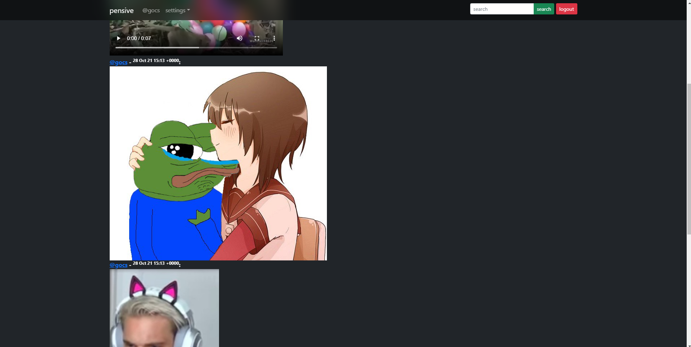

# Pensive




## prerequisites

docker
golang
redis

rename `.env copy` to `.env`

## run dev

```make dev```

## run prod

this includes prometheus and grafana

```make prod```


## license

`Apache 2.0`
